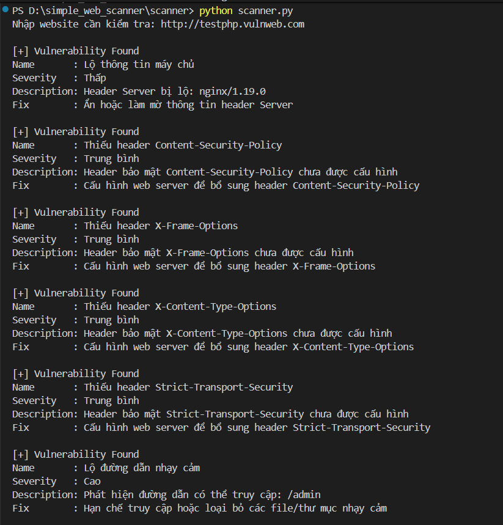

# Simple Web Vulnerability Scanner

## Giới thiệu
Công cụ quét lỗ hổng bảo mật web cơ bản, được xây dựng bằng Python phục vụ mục đích học tập và nghiên cứu.

## Chức năng
- Kiểm tra HTTP Security Headers
- Phát hiện lộ thông tin máy chủ
- Phát hiện đường dẫn nhạy cảm
- Kiểm tra robots.txt
- Phát hiện CMS (WordPress)
- Kiểm tra cổng dịch vụ đang mở

## Cấu trúc thư mục

```text
simple-web-scanner/
├── scanner/
│   └── scanner.py
│   └── report.py
│   └── utils.py
│   └── checks.py
│       └── cms.py
│       └── directories.py
│       └── headers.py
│       └── ports.py
│       └── robots.py
├── web_test/
│   └── admin
│       └── index.html
│   └── login
│       └── index.html
│   └── app.py
│   └── phpinfo.php
│   └── robots.txt
├── screenshots/
│   └── scan_result.png
├── .gitignore
├── LICENSE
└── README.md
```

## Cài đặt

### Yêu cầu
- Python >= 3.8
- pip

### Hướng dẫn nhanh 
```bash
git clone https://github.com/Ansociuu/simple_web_scanner.git
cd simple_web_scanner
pip install -r requirements.txt
```

## Sử dụng

1. Chạy scanner:

```bash
cd scanner
python scanner.py
```
Chương trình sẽ yêu cầu bạn nhập URL/website cần kiểm tra. (Có thể sử dụng: http://testphp.vulnweb.com)

2. Chạy môi trường thử nghiệm cục bộ (`web_test`):

```bash
cd web_test
python app.py
```

## Test Environment
Dự án này bao gồm một ứng dụng web cục bộ dễ bị tấn công (`web_test/app.py`) chỉ dùng cho thử nghiệm và trình diễn.

Ứng dụng được thiết kế để chạy cục bộ và KHÔNG nên được triển khai lên máy chủ sản xuất hoặc môi trường công cộng.

## Legal Disclaimer
Công cụ này được phát triển chỉ nhằm mục đích giáo dục. Tác giả không chịu trách nhiệm cho bất kỳ việc sử dụng sai mục đích nào của công cụ này. Chỉ quét các hệ thống mà bạn sở hữu hoặc có quyền kiểm tra.

## Demo

